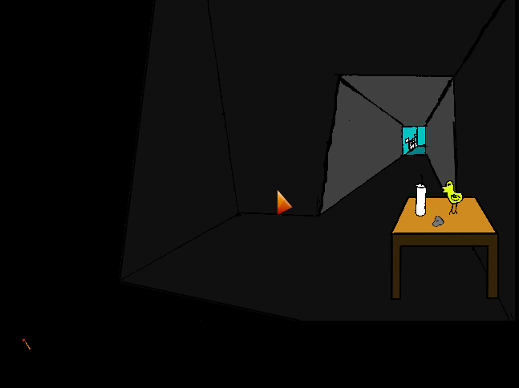

# FloRETs

##Introduction

My **r**oom **e**scape-game **t**ools are in this repo. To make easier myself creating
simple point and click andventure games, wanted to have the following stuffs:
* Inventing JSON descripton for simple room escape games about rooms, objects, possible
  actions.
* **DescriptionChecker**, which is able to test whether the JSON description has no 
  coneptual errors and contradictions, there is one and only one solution, you cannot 
  get lost and cannot die.
* **TextEngine**, which runs the JSON description as a text adventure game in command
  line.
* **PointAndClickEngine** which is for running the JSON description as a point and 
  click adventure game in browser. I added a minimal editor to the game code, to make
  easier to place objects. If variable *devMode = 1*, then pressing key 'p' brings
  to editor mode, and the positions of objects and corridors can be changed.

The gist is that DescriptionChecker makes sure there are no conceptual bug in the
game description, and the reusal of PointAndClickEngine.html makes sure the 
quality of the engine will increase over time.

Codes are in Python and in JavaScript.

## Demo game

Click to the image to try the demo game, which was created with these tools.

## How to use

The steps of developing a new game:
* Writing the JSON description into a text file first.
* Checking it with **DescriptionChecker.py**.
* Creating the images for all room and game objects, and maybe for some game passages.
* Adding the game description to **PointAndClickEngine.html**, adding the images to **imgs**, set *devMode=1*, *useSpriteSheet=0*, *sprites=[]*, *game_object_xy={};*, *game_direction_areas={};*.
* Playing the game through and placing the objects and passages, via entering editor mode with the key 'p'. Coordinates of *game_object_xy* and *game_direction_areas* will be printed to console.log. (I access it with the firebug plugin of firefox.)
* Copy *game_object_xy* and *game_direction_areas* from console.log to **PointAndClickEngine.html**.
* Creating the spritesheet with [Leshy SpriteSheet Tool](https://www.leshylabs.com/apps/sstool/).
* Wire the spritesheet to **PointAndClickEngine.html**, set *useSpriteSheet=1* and *sprites*.
* Go to directory deploy, and use **deploy.sh**, which produces a bitballoon-compatible zipped output.
* Upload it to [bitballoon](https://www.bitballoon.com/).

